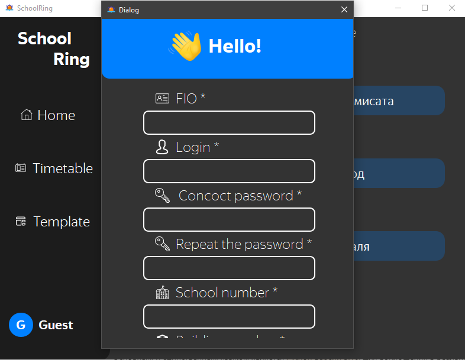
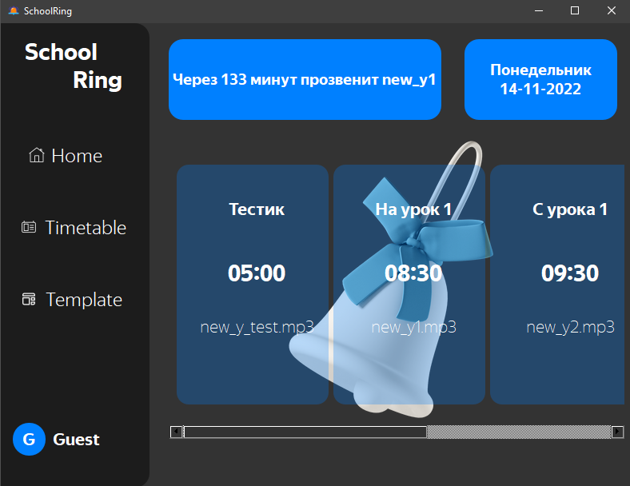
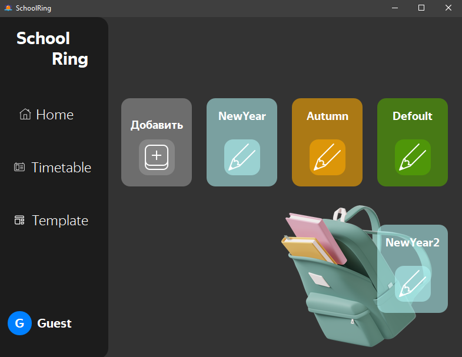

<h2> SchoolRing</h2>

[](https://github.com/alchemmist/SchoolRing)


[![Yandex Lyceum](https://img.shields.io/badge/Yandex%20Lyceum-default?logo=data%3Aimage%2Fpng%3Bbase64%2CiVBORw0KGgoAAAANSUhEUgAAADIAAAAyCAMAAAAp4XiDAAAAIGNIUk0AAHomAACAhAAA%2BgAAAIDoAAB1MAAA6mAAADqYAAAXcJy6UTwAAAHCUExURfw%2FHfxAHvxBH%2Fw%2FHvw7GPw2Evw3FPw2E%2Fw%2BHPw4FPw3E%2Fw6F%2F2civ7Ryf7GvP7Ivv7Mwv67r%2FxGJfw9G%2FxAH%2Fw4Ff6gj%2F7QyP7Hvf7Pxv6rnPw8GvxBIPw0EP1%2FaP%2F%2F%2F%2F2Fb%2FwzDvxCIPw5FvxaPP2YhvwyDv7Vzv%2F7%2Bv%2FZ0vw9GvxCIfwyDf6nl%2F%2F5%2BP%2F8%2B%2F%2Fr5%2FxHJ%2Fw8GfwzD%2F2Ebv%2F8%2FP%2F9%2Ff13X%2FxLK%2F%2Fv7P%2F%2B%2Fv6llf%2Fj3%2F%2F%2B%2Ff%2F9%2FP7Lwv2Qff%2F6%2BfxYO%2F2TgP1pTv7e2P66rvxKKv%2Fu6%2F68sP17Y%2F1qT%2F2ikf%2F%2F%2FvxcP%2FxUNf%2F39f6snv1mS%2F1%2BZ%2F6ypP%2F08%2FxRMv62qf%2Fh3PxfQ%2F6di%2FxVN%2F%2F39v2Ugfw1Ef7Atf%2Fq5%2FxDIv%2Fw7vxNLf1rUf2NePxHJv%2Fp5v6qm%2F7Oxf%2Ff2fxDIfwxDP2HcvxcQP16Yv19Zv%2Fm4fw0Efw%2BG%2F%2Fb1P7Px%2FxEIv18Zf17ZP2Aav2Ic%2F1tU%2FwpBPxEI%2F%2Fm4v7Duf2Yhf1hRf%2Fx7v6vof6mlvxXOf16Y%2F6%2Fs%2F6zpv61qf61qP7Ty%2F%2F6%2Bv7RyP68sf%2Fc1vw6GP2Oev2JdP2Nef14Yfw1EgOmEHUAAAABYktHRB8FDRC9AAAACXBIWXMAAAsTAAALEwEAmpwYAAAAB3RJTUUH6QUcExMeqjDmZQAAAiRJREFUSMftlNlX00AYxTNpG1oibjQI0njtoBFJNNI4EaIN1n3DDXe0qLjvioqCuCu47%2F%2BvMz1tOZzTNOkbD9zH78xv7rfNSNKC5r2ILBSbEyuFSCARTyiK0pScE0w185AawMipRS2Llyxdtrx19kBaa1vR3t6xsjNWE8noqyC0OkurRNeaUmitQWvbSOo6dHdjfU81YFobsNHGpt5cQGbU2QwGF1v08p0k19cPz8ZWywwqP2luQ97HgCKXTYztYB4KO7rSQS0zrZ2w4WFXU5khu%2BEy7NGDKuEnOvfug8ewX8%2BUEtUP8DQ9HKzcUNvmEOxB%2BIc1udT1Afg%2BOoLTEjbqkaOi3mMGr1duPg6OY8ihdRCJZk%2FA9nDyVJzwBp4Gc3FGTsbqIbJ2dhC8Becsk6jD54XjhcAOl5Upjoi%2BXuztuWS1CcPLozkSgiSu8B4xXHXItevI27hhhJiIRbwJ38Wt23fuosA8%2F54mhyFUv8%2BH4eNB8aFYyJFHmTCCa%2BwxXB9Png6Njz97Phwn4QQ1JngteUy%2BSOi6E4WQyNjUS%2BQZXmlTlNIohNia13wywJtUaOFVm9zoWzHDd1kaFeE278UQ%2B%2FvChjirtPqBr4qLj3p0G6pPg9V7vzUQZwaMYboYZYwV5BMY%2FwNS6QaQz%2BKltKiRy68gX%2BYhMoPCV3xrBDG%2Bi7fyowGE%2FJz8NfH7z9%2FWyARnFCtrWP8aIPjnZFJqRp%2F9gurqP1KfYshKUGTLAAAAJXRFWHRkYXRlOmNyZWF0ZQAyMDI1LTA1LTI4VDE5OjE5OjI1KzAwOjAw6awkTgAAACV0RVh0ZGF0ZTptb2RpZnkAMjAyNS0wNS0yOFQxOToxOToyNSswMDowMJjxnPIAAAAodEVYdGRhdGU6dGltZXN0YW1wADIwMjUtMDUtMjhUMTk6MTk6MzArMDA6MDBRdpIUAAAAAElFTkSuQmCC&color=grey)](https://lyceum.yandex.ru/industrial)


Project architect: [@alchemmist](https://github.com/alchemmist)

**Motivation:** Many schools still rely on outdated bell systems with limited customization options. There is a clear need for a modern solution that allows flexible scheduling, personalized sounds, and automatic playback. A system like this would not only improve efficiency but also create a more pleasant and adaptable school environment. By enabling custom templates and easy configuration, the program aims to simplify daily operations and better meet the unique needs of each institution.

**About:** It's a course project in the first block of the industrial programming at [Yandex Academy Lyceum](https://lyceum.yandex.ru/). This software is installed on local school servers and school system administrators or informatics teachers will load a `.xlsx` schedule and music files. Done! More interesting features: like stylization, for example, New Year music for the pre-Christmas study period.

### Functionality

The program has two types of users: **guest** and **administrator**. The administrator has access to all features, including the ability to edit data. The guest, on the other hand, can only view the content.

<div align="center">
    
</div>

The program offers the following features:

- Adding and editing schedules
- Creating themed bell templates

On the left, there is a menu that allows quick access to any tab.
There are three tabs:

- Home
- Timetable
- Template

<div align="center" style="display: flex; gap: 20px;">
    
    
</div>

### Tech Stack
The primary and only programming language used is Python 3.10. To bring all ideas to life, the following technologies were used:

For creating the graphical user interface — `PyQt5`

For automatic bell playback — the `threading` module from Python’s standard library, used for multithreading

For schedule management — the `schedule` from python standart library 

You can find the complete list of libraries and their versions in the [requirements.txt](/requirements.txt) fil.

### System design
While designing the project architecture, I aimed to follow classic patterns such as MVC, the S.O.L.I.D principles, the Gang of Four design patterns, and others. The structure is divided into traditional layers:

First, the logic layer, where I moved all technical processes. This is implemented in the following files:
`data_ceking.py`, `base_of_data.py`, and `services.py`.

Second, the user interaction layer, which includes everything related to the program’s interface, data input, and output. This is represented by the main entry-point file:
`views.py`.

The program consists of several classes that interact with each other. The main class is Window, which directly or indirectly communicates with other classes. There is also a DataBaseManager class, instances of which can be created within other classes to handle all database operations.

You can find details on the remaining classes in [`docs`](/docs) directory.

### How to run it
One command with `uv`:
```sh
uv run python schoolring
```

### Questions | Contribute
If you have questions about this repo or you want to contribute, write to actual project architect (check it in a first line of this README).

### Contributors
- [@alchemmist](https://github.com/alchemmist) as Anton Grishin
